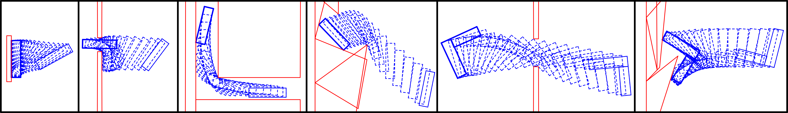
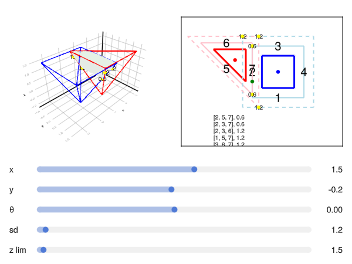

<br />
<p align="center">
	
  <p align="center">
  </p>
</p>

# About PolyPlanning

This repository implements polyhedral collision detection using vertex enumeration formulation. 

Our formulation replaces nonsmooth constraints with multiple smooth constraints. This repository also implements existing baseline formulations to compare and benchmark.

This repository supplements our corresponding conference paper at ICRA 2025.

# Usage

Simple usage example our method is available in [```examples/simple_nonsmooth_example.jl```](examples/simple_nonsmooth_example.jl):
```julia
using PolyPlanning

x0 = [5.0, 0.0, π / 2 + .1, 0, 0, 0];
obs_polys = PolyPlanning.gen_rect_obs();
ego_polys = PolyPlanning.gen_ego_rect();

# (...)

nonsmooth_prob = PolyPlanning.setup_nonsmooth(ego_polys, obs_polys)
PolyPlanning.solve_nonsmooth(nonsmooth_prob, x0)
```

More examples including simple usage examples for baselines methods, the separating hyperplanes and [dcol (differentiable collision detection)](https://arxiv.org/abs/2207.00669) methods are also available in the ```examples``` folder.

## Assignment Playground

We also include interactive demonstration called [assignment playground](examples/assignment_playground.jl) to explore how signed distance assignments work, which you can try for yourself by typing:
```julia
include("examples/assignment_playground.jl")
```

<br />
<p align="center">
	
  <p align="center">
  </p>
</p>


# License

Distributed under the MIT License. See LICENSE for more information.

# Citation

```
@misc{cinar2025polyhedralcollisiondetectionvertex,
      title={Polyhedral Collision Detection via Vertex Enumeration}, 
      author={Andrew Cinar and Yue Zhao and Forrest Laine},
      year={2025},
      eprint={2501.13201},
      archivePrefix={arXiv},
      primaryClass={cs.CG},
      url={https://arxiv.org/abs/2501.13201}, 
}
```
